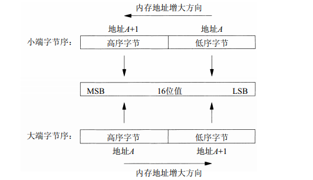

# 套接字编程基础

要了解套接字是什么，让我们从网络连接开始。网络连接是指互联网上两个端点的互相连接在一起，用以实现数据共享。来自计算机A1通过互联网可以与计算机A2连接进行通信，它们会有以下一个属性：

- 可靠，这意味着两台通过电缆相互连接的计算机之间的数据将被安全传输。
- 点对点，在两个点之间建立连接。
- 全双工，这意味着信息的传输可以以两种方式发生，即客户端到服务器以及服务器到客户端的实时消息传递。

套接字是点对点通信信道的两个端点，套接字作用于两部分：IP地址、端口号。其示意图如下：


其中IP地址有两种：

- IPv4，网际协议版本4（Internet Protocol version 4） 。IPv4（通常称之为IP）自20世纪80年代早期以来一直是网际协议族的主力协议。它使用32位地址 。IPv4给TCP、UDP、SCTP、ICMP和IGMP提供分组递送服务。
- IPv6，网际协议版本6（Internet Protocol version 6） 。IPv6是在20世纪90年代中期作为IPv4的一个替代品设计的。其主要变化是使用128位更大地址（见A.5节）以应对20世纪90年代因特网的爆发性增长。IPv6给TCP、UDP、SCTP和ICMPv6提供分组递送服务。当无需区别IPv4和IPv6时，我们经常把“IP”一词作为形容词使用，如IP层、IP地址等。

而端口号是指当一个客户想要跟一个服务器联系时，它必须标识想要与之通信的这个服务器。而服务器必须定义一组众所周知的端口（well-known port），用于标识众所周知的服务。另外，客户通常使用短期存活的临时端口（ephemeral port）。这些端口号通常由传输层协议自动赋予客户。客户通常不关心其临时端口的具体值，而只需确信该端口在所在主机中是唯一的就行。传输协议的代码确保这种唯一性。

最后，一个TCP连接通常需要一个套接字对（socket pair），这是一个定义该连接的两个端点的四元组：本地IP地址、本地TCP端口号、外地IP地址、外地TCP端口号。套接字对唯一标识一个网络上的每个TCP连接。标识每个端点的两个值（IP地址和端口号）通常称为一个套接字。

## 套接字地址

IPv4套接字地址结构通常也称为“网际套接字地址结构” ，它以sockaddr_in命名，定义在<netinet/in.h>头文件中。

```c
struct in_addr {
    in_addr_t s_addr; /* 32-bit IPv4 address */
                      /* network byte ordered */
};

struct sockaddr_in {
    uint8_t sin_len;         /* length of structure (16) */
    sa_family_t sin_family;  /* AF_INET */
    in_port_t sin_port;      /* 16-bit TCP or UDP port number */
                             /* network byte ordered */
    struct in_addr sin_addr; /* 32-bit IPv4 address */
                             /* network byte ordered */
    char sin_zero[8];        /* unused */
};
```

IPv4地址有两种表示方式，一种是淀粉十进制数串（这是人们偏爱使用的格式），例如“206.168.112.96”；另外一种是使用二进制值（这是存放在套接字地址结构中的值）来表示。
inet_aton、inet_addr和inet_ntoa这几个函数可以在点分十进制数串与它长度为32位的网络字节序二进制值间转换IPv4地址。

```c
#include <arpa/inet.h>
int inet_aton(const char *strptr, struct in_addr *addrptr); // 返回：若字符串有效则为1，否则为0
in_addr_t inet_addr(const char *strptr); // 返回：若字符串有效则为32位二进制网络字节序的IPv4地址，否则为INADDR_NONE
char *inet_ntoa(struct in_addr inaddr); // 返回：指向一个点分十进制数串的指针
```

另外，随着IPv6的出现，标准库中又新增了inet_pton 和 inet_ntop 两个函数，这两个函数对于IPv4地址和IPv6地址都适用。函数名中p和n分别代表表达（presentation）和数值（numeric） 。地址的表达格式通常是ASCII字符串，数值格式则是存放到套接字地址结构中的二进制值。

```c
#include <arpa/inet.h>
int inet_pton(int family, const char *strptr, void *addrptr); // 返回：若成功则为1，若输入不是有效的表达格式则为 0，若出错则为-1
const char *inet_ntop(int family, const void *addrptr, char *strptr, size_t len); // 返回：若成功则为指向结果的指针，若出错则为NULL
```

下面是一个进行地址转换的程序实例：

```c
#include <stdio.h>
#include <arpa/inet.h>

int main(void)
{
    unsigned long addr = inet_addr("192.168.0.1");
    printf("addr = %u\n", ntohl(addr));

    struct in_addr ipaddr;
    ipaddr.s_addr = addr;
    printf("%s\n", inet_ntoa(ipaddr));

    return 0;
}
```

运行后打印输出：

```shell
$ ./bin/addr_convert
addr = 3232235521
192.168.0.1
```

## 字节序

内存中存储字节有两种方法：一种是将低序字节存储在起始地址，这称为小端（little-endian）字节序；另一种方法是将高序字节存储在起始地址，这称为大端（big-endian）字节序。所谓“小端”和“大端”是表示多个字节值的哪一端（小端或大端）存储在该值的起始地址。



遗憾的是，这两种字节序之间没有标准可循，两种格式都有系统使用。我们把某个给定系统所用的字节序称为主机字节序（host byte order）。而网络协议中指定的字节序被称为网络字节序（network byte order）。而主机字节序与网路字节序到底是使用大端还是小端，在不同的环境下都是变动的，所以需要对主机字节序和网络字节序之间进行互转可以让我们免于操心转换细节。

主机字节序和网络字节序之间相互转换使用以下4个函数：

```c
include <netinet/in.h>
// 主机字节序到网络字节序转换(host to network)，均返回：网络字节序的值
uint16_t htons(uint16_t host16bitvalue);
uint32_t htonl(uint32_t host32bitvalue);

// 网络字节序到主机字节序转换(network to host)，均返回：主机字节序的值
uint16_t ntohs(uint16_t net16bitvalue);
uint32_t ntohl(uint32_t net32bitvalue);
```

下面程序可以打印输出来确定主机字节序和网络字节序：

```c
#include <stdio.h>

void print_byte_order(const char *p)
{
    printf("%0x %0x %0x %0x\n", p[0], p[1], p[2], p[3]);
    if (p[0] == 2 && p[1] == 1)
        printf("big-endian\n");
    else if (p[0] == 0 && p[1] == 0)
        printf("little-endian\n");
    else
        printf("unknown\n");
}

int main(void)
{
    unsigned int x = 0x0102;
    unsigned char *p = (unsigned char *)&x;
    print_byte_order(p);

    unsigned int y = htonl(x);
    p = (unsigned char *)&y;
    print_byte_order(p);

    return 0;
}
```

在ubuntu系统上运行结果如下：

```shell
$ ./bin/byte_order
2 1 0 0
big-endian
0 0 1 2
little-endian
```

## 基本套接字函数

本节将阐述一个完整的TCP客户/服务器程序所需要的基本套接字函数。了解了所有基本套接字函数之后，我们就可以开发出一个简单的客户/服务器程序。

### 电话系统

一个完整的TCP客户/服务器程序需要由一系列的基本套接字函数组成。建立TCP连接就好比一个电话系统：
socket 函数等同于有电话可用。
bind 函数是在告诉别人你的电话号码，这样他们可以呼叫你。
listen 函数是打开电话振铃，这样当有一个外来呼叫到达时，你就可以听到。
connect 函数要求我们知道对方的电话号码并拨打它。
accept 函数发生在被呼叫的人应答电话之时，返回客户的标识。
getaddrinfo 类似于在电话簿中查找某个人的电话号码。
getnameinfo 则类似于有一本按照电话号码而不是按照用户名排序的电话簿。

### socket 函数

为了执行网络I/O，一个进程必须做的第一件事情就是调用socket函数，指定期望的通信协议类型（使用IPv4的TCP、使用IPv6的UDP、Unix域字节流协议等） 。socket函数在成功时返回一个小的非负整数值，它与文件描述符类似，我们把它称为套接字描述符（socket descriptor） ，简称sockfd，也称为监听套接字（listening socket）描述符。

```c
#include <sys/socket.h>
int socket(int family, int type, int protocol); // 返回：若成功则为非负描述符，若出错则为-
```

其中family参数指明协议族，该参数也往往被称为协议域，当前网络大部分支持的是IPv4，代码中最常用的将会是 AF_INET:
| family | 说明 |
|---|---|
| AF_INET| IPv4协议 |
| AF_INET6 | IPv6协议 |
| AF_LOCAL | Unix域协议 |
| AF_ROUTE | 路由套接字 |
| AF_KEY | 密钥套接字 |

type 参数指明套接字发送和接收数据的方式：
| type | 说明 |
|---|---|
| SOCK_STREAM | 字节流套接字 |
| SOCK_DGRAM | 数据报套接字 |
| SOCK_SEQPACKET | 有序分组套接字 |
| SOCK_RAW | 原始套接字 |

protocol参数表示发送数据时socket应该使用的协议，该值为0时将会选取默认的实现协议：
| protocol | 说明 |
|---|---|
| IPPROTO_TCP | TCP 传输协议 |
| IPPROTO_UDP | UDP传输协议 |
| IPPROTO_SCTP | SCTP传输协议 |

我们可以如下函数创建一个TCP socket:

```c
int tcpSocket = socket(AF_INET, SOCK_STREAM, 0); 
```

调用如下函数创建一个UDP socket:

```c
int udpSocket = socket(AF_INET, SOCK_DGRAM, 0);
```

### bind 函数

bind函数把一个本地协议地址赋予一个套接字。调用bind函数可以指定一个端口号，或指定一个IP地址，也可以两者都指定，还可以都不指定。

```c
include <sys/socket.h>
int bind(int sockfd, const struct sockaddr *myaddr, socklen_t addrlen); //返回：若成功则为0，若出错则为-
```

sockfd是由socket函数返回的套接字描述符，第二个参数是一个指向特定于协议的地址结构的指针，第三个参数是该地址结构的长度。

### listen 函数

 listen函数仅由TCP服务器调用，它做两件事情。
- 当socket函数创建一个套接字时，它被假设为一个主动套接字，也就是说，它是一个将调用connect发起连接的客户套接字。listen函数把一个未连接的套接字转换成一个被动套接字，指示内核应接受指向该套接字的连接请求。根据TCP状态转换图 ，调用listen导致套接字从CLOSED状态转换到LISTEN状态。
- 本函数的第二个参数规定了内核应该为相应套接字排队的最大连接个数。

```c
#include <sys/socket.h>
int listen(int sockfd, int backlog); // 返回：若成功则为0，若出错则为-1
```

### accept 函数

accept函数由TCP服务器调用，用于从已完成连接队列队头返回下一个已完成连接。如果已完成连接队列为空，那么进程被投入睡眠（假定套接字为默认的阻塞方式）

```c
#include <sys/socket.h>
int accept(int sockfd, struct sockaddr *cliaddr, socklen_t *addrlen); // 返回：若成功则为非负描述符，若出错则为-1
```

参数cliaddr和addrlen用来返回已连接的对端进程（客户）的协议地址。它的返回值称为已连接套接字（connected socket）描述符。

### connect 函数

TCP客户用connect函数来建立与TCP服务器的连接。

```c
#include <sys/socket.h>
int connect(int sockfd, const struct sockaddr *servaddr, socklen_t addrlen); // 返回：若成功则为0，若出错则为-1
```

第二个、第三个参数分别是一个指向套接字地址结构的指针和该结构的大小。

### close 函数

通常的Unix close函数也用来关闭套接字，并终止TCP连接。close一个TCP套接字的默认行为是把该套接字标记成已关闭，然后立即返回到调用进程。不能再作为 read 或 write 的第一个参数。

```c
#include <unistd.h>
int close(int sockfd); // 返回：若成功则为0，若出错则为-1
```

### shutdown 函数

有时候我们需要保证所有发送和接受的数据都已经传输和确认。所以最好的方式是先停止传输数据，等待所有数据都被确认，所有传入的数据都被读取，再关闭socket。这种情况下我们可以使用 shutdown 函数。

```c
#include <unistd.h>
int shutdown(int socket, int how);
```

how 参数有3中情况，传入 SD_SEND 将停止发送，传入 SD_RECEIVE 将停止接收，SD_BOTH 表示停止发送和接受。

### read 和 write 函数

一般来说，read 和 write 函数可以操作打开的文件描述符，也可以用于套接字的描述符。
在套接字上的read和write函数所表现的行为不同于通常的文件 I/O。字节流套接字上调用read或write输入或输出的字节数可能比请求的数量少，然而这不是出错的状态。这个现象的原因在于内核中用于套接字的缓冲区可能已达到了极限，在UNIX上管道超过4096字节也会出现这种情况。此时所需的是调用者再次调用read或write函数，以输入或输出剩余的字节。

```c
#include <unistd.h>
ssize_t read(int fd, void *buf, size_t count);
ssize_t write(int fd, const void *buf, size_t count);
```

### recv 和 send 函数

这两个函数和标准的 read 和 write 函数类似，但只能用于套接字的I/O。

```c
#include <sys/socket.h>
ssize_t recv(int sockfd, void *buff, size_t nbytes, int flags);
ssize_t send(int sockfd, const void *buff, size_t nbytes, int flags); 
// 返回：若成功则为读入或写出的字节数，若出错则为-1
```

recv 和 send 的前3个参数等同于 read 和 write 的3个参数。最后一个额外的参数表顺如下：
| family | 说明 |
|---|---|
| MSG_PEEK | 窥看外来消息 |
| MSG_DONTROUTE | 绕过路由表查找 |
| MSG_DONTWAIT | 仅本操作非阻塞 |
| MSG_OOB | 发送或接收带外数据 |
| MSG_WAITALL | 等待所有数据 |

### getsockname 和 getpeername 函数

getsockname 可以用来获取本地套接字协议的地址，比如当某个客户连接建立后（accept成功返回）,可以通过 getsockname 返回由内核赋予该连接的本地 IP 地址。
而 getpeername 用来获取某个关联套接字的外地协议地址，当一个连接建立后，如需要获取对方的的地址以确认唯一身份，getpeername 便利唯一的途径。

```c
#include <sys/socket.h>
int getsockname(int sockfd, struct sockaddr *localaddr, socklen_t *addrlen);
int getpeername(int sockfd, struct sockaddr *peeraddr, socklen_t *addrlen);
// 返回：若成功则为0，若出错则为-1
```

### gethostname、gethostbyname 和 gethostbyaddr 函数

gethostname 可以用来获取主机名。
gethostbyname 则可以通过主机名来获取主机上所有的 ip 地址。
gethostbyaddr 通过一个一个二进制的IP地址获取相应的主机名。

```c
#include <unistd.h>
int gethostname(char *name, size_t len);

#include <netdb.h>
struct hostent *gethostbyname(const char *hostname);
struct hostent *gethostbyaddr(const char *addr, socklen_t len, int family);
```

下面是一个对主机名与主机地址操作的代码实例：

```c
#include "unp.h"

int main()
{
    // get host name
    char host[64] = {0};
    if (gethostname(host, sizeof(host)) < 0)
        errno_abort("gethostname");

    printf("host name : %s\n", host);

    // get host by name
    struct hostent *htptr;
    if ((htptr = gethostbyname(host)) == NULL)
        errno_abort("gethostbyname");

    int i = 0;
    while (htptr->h_addr_list[i] != NULL)
    {
        printf("ip addres : %s\n", inet_ntoa(*(struct in_addr *)htptr->h_addr_list[i]));
        ++i;
    }

    // get host by addr
    struct in_addr hipaddr;
    hipaddr.s_addr = inet_addr("35.187.152.135");

    if ((htptr = gethostbyaddr(&hipaddr, sizeof(hipaddr), AF_INET)) == NULL)
        errno_abort("gethostbyaddr");

    printf("host name : %s\n", htptr->h_name);

    return 0;
}
```