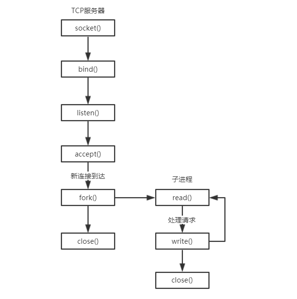

# PPC 与 TPC

## Process Per Connection (PPC)

上一节说的这是比较传统的 Unix 并发网络编程方案，其含义是指每个连接都需要建立一个新进程去处理连接请求。其流程图如下所示：



### 理解 `fork` 函数

结合流程图，在编写并发服务器程序之前，我们需要先了解 Unix 的 `fork()` 函数，该函数是Unix中派生新进程的唯一方法。

```c
#include <unistd.h>
pid_t fork(void);
```

理解 fork 最困难之处在于调用它一次，它却返回两次。它在调用进程（称为父进程）中返回一次，返回值是新派生进程（称为子进程）的进程ID号；在子进程又返回一次，返回值为0。因此，返回值本身告知当前进程是子进程还是父进程。

fork在子进程返回0而不是父进程的进程ID的原因在于：任何子进程只有一个父进程，而且子进程总是可以通过调用getppid取得父进程的进程ID。相反，父进程可以有许多子进程，而且无法获取各个子进程的进程ID。如果父进程想要跟踪所有子进程的进程ID，那么它必须记录每次调用fork的返回值。

父进程中调用fork之前打开的所有描述符在fork返回之后由子进程分享。我们将看到网络服务器利用了这个特性：父进程调用 `accept` 之后调用 `fork`。所接受的已连接套接字随后就在父进程与子进程之间共享。通常情况下，子进程接着读写这个已连接套接字，父进程则关闭这个已连接套接字。

### 实现 PPC

有了上面的关于何如生成子进程的基础知识，我们就可以通过代码实现一个并发网络服务器：

```c
#include <signal.h>
#include <sys/wait.h>

#include "unp.h"

void echo_handle(int connfd)
{
    char data[1024];
    while(1)
    {
        memset(&data, 0, sizeof(data));
        int ret = Read(connfd, data, sizeof(data));
        if (ret == 0)
        {
            printf("clinet disconnect\n");
            close(connfd);
            break;
        }

        printf("echo %lu bytes, data receved at %s", strlen(data), data);

        Write(connfd, data, ret);
    }
}

void sig_child_handle(int signo)
{
    pid_t pid;
    int stat;

    while ((pid = waitpid(-1, NULL, WNOHANG)) > 0)
        printf("child %d terminated\n", pid);
}

int main()
{
    int listenfd, connfd;
    struct sockaddr_in peeraddr;
    socklen_t peeraddrlen = sizeof(peeraddr);
    pid_t pid;

    listenfd = Socket(AF_INET, SOCK_STREAM, 0);

    struct sockaddr_in servaddr;
    memset(&servaddr, 0, sizeof(servaddr));
    servaddr.sin_family = AF_INET;
    servaddr.sin_port = htons(SERV_PORT);
    servaddr.sin_addr.s_addr = htonl(INADDR_ANY);

    Bind(listenfd, (struct sockaddr *)&servaddr, sizeof(servaddr));

    Listen(listenfd, SOMAXCONN);

    signal(SIGCHLD, sig_child_handle);
    signal(SIGPIPE, SIG_IGN);

    while (1)
    {
        if ((connfd = accept(listenfd, (struct sockaddr *)&peeraddr, &peeraddrlen)) < 0)
            errno_abort("accept error");

        printf("new connection, ip = %s, port = %d\n", inet_ntoa(peeraddr.sin_addr), ntohs(peeraddr.sin_port));

        pid = fork();
        if (pid < 0)
            errno_abort("fork error");
        else if (pid == 0)
        {
            close(listenfd);
            echo_handle(connfd);
            exit(EXIT_SUCCESS);
        }
        else
            close(connfd);
    }

    return 0;
}
```

从 `main` 函数开始，与之前所写的回射服务器准备流程差不多：创建套接字、绑定、监听。

调用 `accept` 等待客户端连接后，我们使用 `fork` 函数（），为每一个客户派生一个处理它们的子进程，如上面描述的使用 `fork` 函数的流程，我们需要在父进程关闭已连接套接字，并在子进程中关闭监听套接字。注意，因为套接字存在一个引用计数，所以上面调用 `close` 函数并不是真正的关闭，而只是减少一个引用计数而已。

然后在子进程中，把套接字交给函数 `echo_handle` 进程计算处理。

### 处理 SIGCHILD 信号

在多进程程序中，会有一个问题，如果一个进程终止，而该进程有子进程处于僵死状态，那么它的所有僵死子进程的父进程ID将被重置为1（init进程）。我们显然不愿意留存僵死进程。它们占用内核中的空间，最终可能导致我们耗尽进程资源。无论何时我们 `fork` 子进程都得 `wait` 它们，以防它们变成僵死进程。

因此上面程序我们建立了该信号的处理函数，上面所示代码的 `listen` 函数调用之后，增加如下函数调用 `signal` 函数处理 `SIGCHLD` 信号，并指定处理函数 `sig_child_handle`。

`sig_child_handle` 函数调用 `wait_pid` 等待子进程结束，并打印结束的子进程号。

### 处理 SIGPIPE 信号

往一个已经接收到FIN的套接字中写数据是可行的，接收到FIN仅仅代表对方不在发送数据，但这样写数据会收到一个 `RST` 复位信号。
此时如果继续调用 `write` 向对方发送数据，服务进程会收到到 `SIGPIPE` 信号而自动退出（要死一起死）。但一个对端TCP的关闭，并不意味着整个进程都结束，所以，对于这个信号处理我们通常忽略即可。

比如下面这个程序：

```c
void echo_handle(int sockfd)
{
    int n;
    char sendline[1024] = {0};
    char recvline[1024] = {0};

    while (fgets(sendline, sizeof(sendline), stdin) != NULL)
    {
        Writen(sockfd, sendline, strlen(sendline));
        sleep(1);
        Writen(sockfd, sendline, strlen(sendline));

        int ret = Readline(sockfd, recvline, sizeof(recvline));
        if (ret == 0)
        {
            printf("server disconnect\n");
            break;
        }

        printf("echo %ld bytes, data receved at %s", strlen(recvline), recvline);

        memset(&sendline, 0, sizeof(sendline));
        memset(&recvline, 0, sizeof(recvline));
    }
}
```

我们调用 `writen` 两次：第一次把文本行数据的第一个字节写入套接字，暂停一秒钟后，第二次把同一文本行中剩余字节写入套接字。目的是让第一次 `writen` 引发一个 `RST`，再让第二个 `writen` 产生 `SIGPIPE`。
`SIGPIPE` 信号默认动作将直接关闭程序，所以我们需要将该信号处理办法直接设置为 `SIG_IGN`，忽略即可。

### 运行 PPC 测试程序

你可以在 `ppc_server.c` 中找到该实例源代码，编译后运行，客户分别输入 `hello` 和 `world` 消息后，断开连接：

```shell
$ ./bin/ppc_server
new connection, ip = 127.0.0.1, port = 52941
echo 6 bytes, data receved at hello
echo 6 bytes, data receved at world
clinet disconnect
child 2706 terminated
```

```shell
$ ./bin/echo_client
hello
echo 6 bytes, data receved at hello
world
echo 6 bytes, data receved at world
^C
```

你也可以启用多个客户端测试这个并发程序。

## Thread Per Connection (TPC)

对于 `accept+thread` 类型并发服务器，其含义是指每新建一个连接就创建一个新线程去处理。与上面的多进程方案相对，线程更加轻量级，创建线程的开销也会更少。其基本流程图如下所示：\


### 使用线程

在 Unix 中，我们使用的线程是 Pthreads。有关 Phtreads 如果你不熟悉，可以参考 [这个链接](http://localhost:8989/tags/POSIX-Pthreads/) 里面的一系列文章。

我们的程序实现需要用到:

- 线程唯一标识符，`pthread_t`
- 创建线程函数，`pthread_create`，创建并执行执行线程的函数，以及传输给线程的参数。
- 分离线程函数，`pthread_deatch`，连接处理线程是不需要控制的线程，线程在结束后，我们希望其所属资源可以立即被系统回收。

### 实现 TPC

根据流程图，以及线程知识，编写的 TCP 并发服务器实现如下：

```c
#include <pthread.h>
#include <signal.h>
#include <sys/wait.h>

#include "unp.h"

typedef struct session_type {
    pthread_t thread_id;
    int connfd;
} session_t;

void echo_handle(int connfd)
{
    char data[1024];
    while (1)
    {
        memset(&data, 0, sizeof(data));
        int ret = Read(connfd, data, sizeof(data));
        if (ret == 0)
        {
            printf("clinet disconnect\n");
            close(connfd);
            break;
        }

        printf("echo %lu bytes, data receved at %s", strlen(data), data);

        Write(connfd, data, ret);
    }
}

void *thread_routine(void *arg)
{
    int status;
    session_t *session = (session_t *)arg;

    status = pthread_detach(session->thread_id);
    if (status != 0)
        err_abort(status, "Detach thread");

    echo_handle(session->connfd);

    free(session);

    return NULL;
}

int main()
{
    int listenfd, connfd;
    struct sockaddr_in peeraddr;
    socklen_t peeraddrlen = sizeof(peeraddr);
    int status;

    listenfd = Socket(AF_INET, SOCK_STREAM, 0);

    struct sockaddr_in servaddr;
    memset(&servaddr, 0, sizeof(servaddr));
    servaddr.sin_family = AF_INET;
    servaddr.sin_port = htons(SERV_PORT);
    servaddr.sin_addr.s_addr = htonl(INADDR_ANY);

    Bind(listenfd, (struct sockaddr *)&servaddr, sizeof(servaddr));

    Listen(listenfd, SOMAXCONN);

    signal(SIGPIPE, SIG_IGN);

    while (1)
    {
        if ((connfd = accept(listenfd, (struct sockaddr *)&peeraddr, &peeraddrlen)) < 0)
            errno_abort("accept error");

        printf("new connection, ip = %s, port = %d\n", inet_ntoa(peeraddr.sin_addr), ntohs(peeraddr.sin_port));

        session_t *session = malloc(sizeof(session_t));
        if (session == NULL)
            errno_abort("Allocate structure");

        session->connfd = connfd;

        status = pthread_create(&session->thread_id, NULL, thread_routine, session);
        if (status != 0)
            err_abort(status, "Create thread");
    }

    return 0;
}
```

这个程序主线程大部分时间还是阻塞在一个accept调用之中，每当它返回一个客户连接时，我们需要先保存一个回话结构 `session_t`，里面保存着线程ID和已连接套接字标识符，这个结构数据将会传送给创建出来的子线程，供后续处理。

然后我们调用 `pthread_create` 创建一个新线程，并指明线程执行的函数是 `thread_routine`，指定线程传入的参数。

在子线程执行函数中我们先调用 `pthread_detach` 分离线程，然后执行 `echo_handle` 处理客户端会话。

最后，在客户端断开连接后，释放线程数据。

### 运行 TPC 测试程序

你可以在 `tpc_server.c` 中找到该实例源代码，编译后运行，如PPC程序一样，客户分别输入 `hello` 和 `world` 消息后，断开连接：

```shell
$ ./bin/tpc_server
new connection, ip = 127.0.0.1, port = 50991
echo 6 bytes, data receved at hello
echo 6 bytes, data receved at world
clinet disconnect
```

```shell
 ./bin/echo_client
hello
echo 6 bytes, data receved at hello
world
echo 6 bytes, data receved at world
^C
```