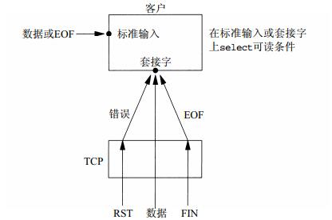

# I/O 复用：select 与 poll

标准输入和TCP套接字。我们遇到的问题是就在客户阻塞于（标准输入上的）fgets调用期间，服务器进程会被杀死。服务器TCP虽然正确地给客户TCP发送了一个FIN，但是既然客户进程正阻塞于从标准输入读入的过程，它将看不到这个EOF，直到从套接字读时为止。这样的进程需要一种预先告知内核的能力，使得内核一旦发现进程指定的一个或多个I/O条件就绪（也就是说输入已准备好被读取，或者描述符已能承接更多的输出），它就通知进程。这个能力称为 **I/O复用**。

网络编程中I/O复用中主要由 `select` 和 `poll` 这两个函数支持的。

## select 函数

该函数允许进程指示内核等待多个事件中的任何一个发生，并只在有一个或多个事件发生或经历一段指定的时间后才唤醒它。也就是说，我们调用select告知内核对哪些描述符（就读、写或异常条件）感兴趣以及等待多长时间。我们感兴趣的描述符不局限于套接字，任何描述符都可以使用select来测试。

作为一个例子，我们可以调用 `select`，告知内核仅在下列情况发生时才返回：

- 集合{1，4，5}中的任何描述符准备好读；
- 集合{2，7}中的任何描述符准备好写；
- 集合{1，4}中的任何描述符有异常条件待处理；
- 已经历了10.2秒。

```c
#include <sys/select.h>
#include <sys/time.h>
int select(int maxfdp1, fd_set *readset, fd_set *writeset, fd_set *exceptset, const struct timeval *timeout);
```

### select 函数参数

该函数中间的三个参数 `readset`、`writeset` 和 `exceptset` 指定我们要让内核测试读、写和异常条件的描述符。`select` 使用描述符集，通常是一个整数数组，其中每个整数中的每一位对应一个描述符。如果我们对某一个的条件不感兴趣，就可以把它设为空指针。

参数类型 `fd_set` 支持一下几个宏操作：

```c
void FD_ZERO(fd_set *fdset); // 清空集合 fd_set
void FD_SET(int fd, fd_set *fdset); // 把文件描述符添加到 fd_set 中
void FD_CLR(int fd, fd_set *fdset); // 将文件描述符从 fd_set 中移除
int  FD_ISSET(int fd, fd_set *fdset); // 判定文件描述符是否在 fd_set 中
```

例如以下代码用于定义一个 `fd_set` 类型的变量，然后打开描述符1、4和5的对应位：

```c
fd_set rset;
FD_ZERO(&rset);
FD_SET(1, &rset);
FD_SET(4, &rset);
FD_SET(5, &rset);
```

参数 `maxfdp1` 指定待测试的描述符个数，它的值是待测试的最大描述符加1（因此我们把该参数命名为maxfdp1）。头文件 `<sys/select.h>` 中定义的 `FD_SETSIZE` 常值是数据类型 `fd_set` 中的描述符总数，其值通常是1024，不过很少有程序用到那么多的描述符。另外，这个值是不可以更改的，如果要修改则必须重新编译内核。

参数 `timeout` 它告知内核等待所指定描述符中的任何个就绪可花多长时间。其timeval结构用于指定这段时间的秒数和微秒数：

```c
struct timeval {
    long tv_sec; /* seconds */
    long tv_usec; /* microseconds */
};
```

这个参数有以下三种可能：

- 永远等待下去：仅在有一个描述符准备好I/O时才返回。为此，我们把该参数设置为空指针。
- 等待一段固定时间：在有一个描述符准备好I/O时返回，但是不超过由该参数所指向的 `timeval` 结构中指定的秒数和微秒数。
- 根本不等待：检查描述符后立即返回，这称为轮询（polling）。为此，该参数必须指向一个timeval结构，而且其中的定时器值（由该结构指定的秒数和微秒数）必须为0。

### select 读、写、异常事件发生条件

`select` 函数会产生3种事件，每种事件都有一定的条件才会触发：

可读：

- 套接口缓冲区有数据可读
- 连接的读一半关闭，即接收到FIN段，都操作将返回0
- 监听套接口，已完成连接队列不为空时
- 套接口发生一个错误待处理，错误可以通过 `getsockopt` 指定 `SO_ERROR` 选项来获得

可写：

- 套接口发送缓冲区有空间容纳数据
- 连接的写一半关闭，即收到 `RST` 段之后，再次调用 `write` 操作。
- 套接口上发生了一个错误处理，错误可以通过 `getsockopt` 指定 `SO_ERROR` 选项来获取

异常：

- 套接口存在带外数据

### select 客户端实现

回顾下我们之前设计的 `echo_clinet.c` 的客户端代码实现：

```c
void echo_handle(int sockfd)
{
    int n;
    char sendline[1024] = {0};
    char recvline[1024] = {0};

    while (fgets(sendline, sizeof(sendline), stdin) != NULL)
    {
        Writen(sockfd, sendline, strlen(sendline));

        int ret = Readline(sockfd, recvline, sizeof(recvline));
        if (ret == 0)
        {
            printf("server disconnect\n");
            break;
        }

        printf("echo %ld bytes, data receved at %s", strlen(recvline), recvline);

        memset(&sendline, 0, sizeof(sendline));
        memset(&recvline, 0, sizeof(recvline));
    }
}
```

这个版本的客户端程序会存在几个问题，当套接字上发生某些事件时，客户可能阻塞于 `fgets` 调用，从而无法立即相应套接字上的事件。改为阻塞于select调用后，将是等待标准输入可读，或是等待套接字可读。下图展示了调用select所处理的各种条件。



客户的套接字上的三个条件处理如下：

- 如果对端TCP发送数据，那么该套接字变为可读，并且read返回一个大于0的值（即读入数据的字节数）。
- 如果对端TCP发送一个FIN（对端进程终止），那么该套接字变为可读，并且read返回0（EOF）。
- 如果对端TCP发送一个RST（对端主机崩溃并重新启动），那么该套接字变为可读，并且read返回-1，而errno中含有确切的错误码。

下面给出使用 `select` 函数实现的客户端源码（源文件`select_fds.c`）：

```c
#include "unp.h"

void fds_select_handler(int sockfd)
{
    int count;
    int n;
    fd_set rset;
    int nready;
    int maxfd;

    char sendline[1024] = {0};
    char recvline[1024] = {0};

    int stdinfd = fileno(stdin);
    if (stdinfd > sockfd)
        maxfd = stdinfd;
    else
        maxfd = sockfd;

    FD_ZERO(&rset);

    while (1)
    {
        FD_SET(stdinfd, &rset);
        FD_SET(sockfd, &rset);

        nready = select(maxfd + 1, &rset, NULL, NULL, NULL);
        if (nready == -1)
            errno_abort("select error");

        if (nready == 0)
            continue;

        if (FD_ISSET(sockfd, &rset))
        {
            n = Readline(sockfd, recvline, sizeof(recvline));
            if (n == 0)
            {
                printf("server disconnect\n");
                break;
            }

            printf("echo %d bytes, data receved at %s", n, recvline);
            memset(&recvline, 0, sizeof(recvline)); 
        }

        if (FD_ISSET(stdinfd, &rset))
        {
            if (fgets(sendline, sizeof(sendline), stdin) == NULL)
                break;

            Writen(sockfd, sendline, strlen(sendline));
            memset(&sendline, 0, sizeof(sendline));
        }
    }
}

int main(void)
{
    int sockfd = Socket(AF_INET, SOCK_STREAM, 0);

    struct sockaddr_in servaddr;
    memset(&servaddr, 0, sizeof(servaddr));
    servaddr.sin_family = AF_INET;
    servaddr.sin_port = htons(SERV_PORT);
    servaddr.sin_addr.s_addr = inet_addr("127.0.0.1");

    Connect(sockfd, (struct sockaddr *)&servaddr, sizeof(servaddr));

    fds_select_handler(sockfd);

    return 0;
}
```

我们先使用 `fileno` 函数把标准输入 `stdin` 指针转换为对应的描述符 `stdinfd`，并确定最大描述符 `maxfd`。
接下来只需要一个用于检查可读性的描述符集。该集合由 `FD_ZERO` 初始化，并用 `FD_SET` 打开两位：一位对应于标准I/O文件描述符 `stdinfd`，一位对应于套接字 `sockfd`。

然后调用 `select`，如果返回时套接字是可读的，那就先用 `readline` 读入回射文本行，再用输出它。如果标准输入可读，那就先用 `fgets` 读入一行文本，再用 `writen` 把它写到套接字中。

由上面代码可见，新的版本是由 `select` 调用来驱动的，而旧的版本则是由 `fgets` 调用来驱动的。仅增加了几行代码，就大大提高了客户程序的健壮性。

### select 服务端实现

在上一节关于 `PPC` 与 `TPC` 的实现中，回射服务器程序对新连接的客户端都是采用派生子进程或创建子线程的方式，这些并发服务器对于一个高性能、高并发的标准来说还是不够的。我们可以使用 `select` 来初步实现一个单进程、单线程的 `Reactor` 并发服务器模型。

```c
#include "unp.h"

void server_select_handler(int listenfd)
{
    int i, maxi, maxfd, connfd, sockfd;
    ssize_t n;
    char buf[MAX_MSG_SIZE];
    int nready, fds[FD_SETSIZE];
    fd_set rset, allset;
    socklen_t clilen;
    struct sockaddr_in cliaddr;

    maxi = -1;
    maxfd = listenfd;
    for (i = 0; i < FD_SETSIZE; i++)
        fds[i] = -1;

    FD_ZERO(&allset);
    FD_SET(listenfd, &allset);

    for (;;)
    {
        rset = allset;
        nready = select(maxfd + 1, &rset, NULL, NULL, NULL);
        if (nready < 0)
        {
            if (errno == EINTR)
                continue;

            errno_abort("select error");
        }

        if (FD_ISSET(listenfd, &rset))
        {
            clilen = sizeof(cliaddr);
            connfd = Accept(listenfd, (struct sockaddr *)&cliaddr, &clilen);

            printf("new connection, ip = %s port = %d\n", inet_ntoa(cliaddr.sin_addr), ntohs(cliaddr.sin_port));

            for (i = 0; i < FD_SETSIZE; i++)
                if (fds[i] < 0)
                {
                    fds[i] = connfd;
                    if (i > maxi)
                        maxi = i;
                    break;
                }

            if (i == FD_SETSIZE)
                err_quit("too many fdss");

            FD_SET(connfd, &allset);

            if (connfd > maxfd)
                maxfd = connfd;

            if (nready-- <= 0)
                continue;
        }

        for (i = 0; i <= maxi; i++)
        {
            sockfd = fds[i];

            if (sockfd < 0)
                continue;

            if (FD_ISSET(sockfd, &rset))
            {
                memset(&buf, 0, sizeof(buf));
                n = Readline(sockfd, buf, MAX_MSG_SIZE);
                if (n == 0)
                {
                    printf("fds disconnect\n");
                    FD_CLR(sockfd, &allset);
                    Close(sockfd);
                    fds[i] = -1;
                }
                else
                {
                    printf("echo %ld bytes, data receved at %s", strlen(buf), buf);
                    Writen(sockfd, &buf, strlen(buf));
                }

                if (--nready <= 0)
                    break;
            }
        }
    }
}

int main(void)
{
    int listenfd, connfd;

    listenfd = Socket(AF_INET, SOCK_STREAM, 0);

    struct sockaddr_in servaddr;
    memset(&servaddr, 0, sizeof(servaddr));
    servaddr.sin_family = AF_INET;
    servaddr.sin_port = htons(SERV_PORT);
    servaddr.sin_addr.s_addr = htonl(INADDR_ANY);

    Bind(listenfd, (struct sockaddr *)&servaddr, sizeof(servaddr));

    Listen(listenfd, SOMAXCONN);

    server_select_handler(listenfd);

    return 0;
}
```

上面程序中创建监听套接字的步骤与早先版本一样：`socket`、`bind` 和 `listen`。

程序使用 `allset` 来存储所有需要检查的套接字，包括监听、已连接套接字。使用 `fds` 数组来存储已连接的客户端，数组中每一项使用默认值-1来标识未使用。

程序调用 `select` 阻塞等待某个事件发生：或是新客户连接的建立，或是数据、FIN或RST的到达。
如果监听套接字变为可读，那么新的连接到达，需要调用 `accept` 接受新连接，并使用 `fds` 数组中的第一个未用项记录这个已连接描述符。就绪描述符数目减1，若其值变为0，就可以避免进入下一个for循环。

对于每个现有的客户连接，我们要测试其描述符是否在 `select` 返回的描述符集中。如果是就从该客户读入一行文本并回射给它。如果客户关闭了连接，那么read将返回0，把客户端套接字哦那个 `allset` 中移除，并关闭客户端。

## poll 函数

poll提供的功能与select类似，不过在处理流设备时，它能够提供额外的信息。下面是 `poll` 函数描述：

```c
#include <poll.h>
int poll(struct pollfd *fdarray, unsigned long nfds, int timeout);
```

第一个参数 `fdarray` 是指向一个结构数组第一个元素的指针。每个数组元素都是一个 `pollfd` 结构，用于指定测试某个给定描述符fd的条件：

```c
struct pollfd {
    int fd; // 要检查的描述符
    short events; // 描述符感兴趣的事件
    short revents; // events 中已经触发的事件
};
```

我们可以设置一些感兴趣的事件给相应的描述符，下面是 `events` 以及 `revents` 通用事件的值，前面4个处理是处理输入常值，后面3个是处理输出常值：

- POLLIN - 普通或优先级带数据可读
- POLLRDNORM - 普通数据可读
- POLLRDBAND - 优先级带数据可读
- POLLPRI - 高优先级数据可读

- POLLOUT - 普通数据可写
- POLLWRNORM - 普通数据可写
- POLLWRBAND - 优先级带数据可写

下面是 `revents` 独立返回的值：

- POLLERR - 发生错误
- POLLHUP - 发生挂起
- POLLNVAL - 描述符不是一个打开的文件

如果对上面任何一个事件感兴趣的话，可以直接使用常量标记之间进行按位或运算：

```c
// new clinet connection
if (fds.revents & POLLRDNORM) {
}

// check all fdss for data
if (fds.revents & (POLLRDNORM | POLLERR)) {
}
```

第二个参数 `nfds` 用来标识结构体 `fdarray` 元素总个数。

第三个参数 `timeout` 用来指定poll函数返回前等待多长时间。它是一个指定应等待毫秒数的正值。这个值有3中情况：

- 负数，永远等待。
- 0，调用后不阻塞且立即返回。
- >0，等待指定毫秒数。

### poll 服务器实现

我们用 `poll` 代替 `select` 重写上面的回射服务器程序：

```c
#include "unp.h"

void server_poll_handler(int listenfd)
{
    int i, maxi, connfd, sockfd;
    ssize_t n;
    char buf[MAX_MSG_SIZE];
    int nready;
    socklen_t clilen;
    struct sockaddr_in cliaddr;
    struct pollfd fds[POLL_FD_SIZE];

    for (i = 0; i < POLL_FD_SIZE; i++)
        fds[i].fd = -1;

    maxi = 0;
    fds[0].fd = listenfd;
    fds[0].events = POLLIN;

    for ( ; ; )
    {
        nready = poll(fds, maxi + 1, -1);
        if (nready < 0)
        {
            if (errno == EINTR)
                continue;

            errno_abort("poll error");
        }

        if (fds[0].revents & POLLIN)
        {
            clilen = sizeof(cliaddr);
            connfd = Accept(listenfd, (struct sockaddr *)&cliaddr, &clilen);

            printf("new connection, ip = %s port = %d\n", inet_ntoa(cliaddr.sin_addr), ntohs(cliaddr.sin_port));

            for (i = 0; i < POLL_FD_SIZE; i++)
                if (fds[i].fd < 0)
                {
                    fds[i].fd = connfd;
                    fds[i].events = POLLIN;
                    if (i > maxi)
                        maxi = i;
                    break;
                }

            if (i == POLL_FD_SIZE)
                err_quit("too many fdss");

            if (--nready <= 0)
                continue;
        }

        for (i = 1; i <= maxi; i++)
        {
            sockfd = fds[i].fd;

            if (sockfd < 0)
                continue;

            if (fds[i].revents & POLLIN)
            {
                memset(&buf, 0, sizeof(buf));
                n = Readline(sockfd, buf, MAX_MSG_SIZE);
                if (n == 0)
                {
                    printf("fds disconnect\n");
                    Close(sockfd);
                    fds[i].fd = -1;
                }
                else
                {
                    printf("echo %ld bytes, data receved at %s", strlen(buf), buf);
                    Writen(sockfd, &buf, strlen(buf));
                }

                if (--nready <= 0)
                    break;
            }
        }
    }
}

int main(void)
{
    int listenfd, connfd;

    listenfd = Socket(AF_INET, SOCK_STREAM, 0);

    struct sockaddr_in servaddr;
    memset(&servaddr, 0, sizeof(servaddr));
    servaddr.sin_family = AF_INET;
    servaddr.sin_port = htons(SERV_PORT);
    servaddr.sin_addr.s_addr = htonl(INADDR_ANY);

    Bind(listenfd, (struct sockaddr *)&servaddr, sizeof(servaddr));

    Listen(listenfd, SOMAXCONN);

    server_poll_handler(listenfd);

    return 0;
}
```

上面程序中，我们先定义了 `POLL_FD_SIZE` 指定了服务器所能承载的最大客户端数量，并用数组 `fds` 来保存所有套接字的 `pollfd` 结构。 `fds` 数组的第一项用于监听套接字，并设置对 `POLLIN` 事件感兴趣，当新连接建立后，`poll` 函数将会触发该事件通知我们。 `fds` 的其余项先设置为 -1。

在事件循环中，我们首先调用 `poll` 函数以等待新连接建立或连接有数据可读。

当新连接建立后，我们先查找 `fds` 是否还有位置可以容纳新客户端，找到可用的项后，记录新连接的套接字，并把新连接的套接字感兴趣的事件设置为 `POLLIN`。

然后检查 `fds` 数组的其余套接字，如果有 `POLLIN` 事件则从该套接字中读取一行数据并回射给客户端。

## select 与 poll 对比

### 功能对比

- `select` 与 `poll` 除了一些细节不同外，总体来说提供的功能基本是一样的。
- `select` 存在最大描述符的限制，有些Unix系统可以通过重新编译内核修改，但Linux则不可更改。虽然 `poll` 函数没有了 `select` 最大描述符的限制，但是受限于前面说的遍历整个集合的情况，当描述符不断增长时，`poll` 函数的效率会直线下降。
- `poll` 虽然提供了一些事件的监听机制，但并没有增加其本身在网络编程中的价值。
- `select` 和 `poll` 有不同的超时等待值。`poll` 需要的是毫秒数（milliseonds），而 `select` 需要一个提供微秒分辨率的 `struct timeval` 指针。然而，在实践中，这并没有什么区别。

### 速度对比

- 它们都以线性方式处理文件描述符。你要求它们检查的描述符越多，它们就越慢。一旦描述符数量超过上百个，那么等待检查描述符的时间将成为一个性能瓶颈点。
- 应用层每次调用 `select`、`poll` 函数，都需要把 `fd` 集合拷贝到内核中去，并且每次调用都需要在内核中轮询整个 `fd` 列表集合，这种拷贝加轮询整个集合做法显然效率不会很高。
- `select` 对每个文件描述符最多使用 3 位数据，而 `poll` 通常对每个文件描述符使用 64 位的数据。`poll` 因此需要将更多的内容复制到内核空间，`select`这方面会更有优势。