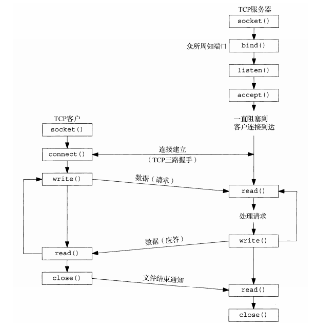

# TCP 回射服务器

了解了基本的套接字函数，就可以编写一个完整的TCP客户/服务器程序示例了。这个简单的例子是执行如下步骤的一个回射服务器：
(1) 客户从标准输入读入一行文本，并写给服务器；
(2) 服务器从网络输入读入这行文本，并回射给客户；
(3) 客户从网络输入读入这行回射文本，并显示在标准输出上。


## 包裹函数

为了更加方便的编写代码程序，我们需要对基础的套接字函数进行一些简单的封装，并让这一系列的函数需要进行简单的错误处理，输出基础的错误信息。

套接字相关操作函数如果出错都会设置 `errno` 的值，可以通过 `perror` 用来将上一个函数发生错误的原因输出到标准设备(stderr)。为了避免在实例代码中的每个函数中都增加报错和退出的代码段，我们需要编写一个报错宏，使用 `errno_abort` 检查 errno 错误变量，并输出错误：

```c
#define errno_abort(text) \
    do {\
        fprintf(stderr, "%s at \"%s\":%d: %s\n",\
            text, __FILE__, __LINE__, strerror(errno));\
        abort();\
    } while(0)
```

上面 `errno_abort` 宏反斜线代表该行未结束，会串接下一行。而如果宏里有多过一个语句，就需要用 `do { /*...*/ } while(0)` 包裹成单个语句，否则会有如下的问题：

```c
#define F() foo(); bar()
```

如果我们这样调用：

```c
if (cond)
    F();
```

那么宏拓展后：

```c
if (cond)
    foo();
bar();
```

而使用 `do { /*...*/ } while(0)` 就能满足我们需求：

```c
#define F() do { foo(); bar(); } while(0)

// 预处理后
if (foo)
    do { foo(); bar(); } while(0);
```

于是，有了一个简单的错误处理宏后，我们就可以开始编写一个简单的 `scoket` 包裹函数了：

```c
int Socket(int family, int type, int protocol)
{
    int n;

    if ((n = socket(family, type, protocol)) < 0)
        errno_abort("socket error");

    return n;
}
```

## 实现

基本的TCP客户/服务程序流程如下图所示：



### 服务器程序

对于服务器程序一个基础的准备流程是：

- 创建一个TCP套接字。
- 在待捆绑到该TCP套接字的网际网套接字地址结构中填入通配地址（INADDR_ANY）和服务器的众所周知端口（SERV_PORT，在头文件unp.h中其值定义为9877）。
- 绑定、监听。调用 `bind` 函数把套接字绑定到指定网际网套接字地址结构中，并调用 `linsten` 函数将套接字转换成一个监听套接字。
- 服务器阻于 `accept` 调用，开始等待客户连接的完成。
- 客户端连接建立后，产生一个已连接套接字，并交给服务处理函数 `echo_handle`。
- 函数 `echo_handle` 处理每一个客户连接服务，从客户端读入数据，并把数据回射给客户。

```c
#include "unp.h"

void echo_handle(int connfd)
{
    int ret;
    char recvbuf[1024];
    while (1)
    {
        memset(&recvbuf, 0, sizeof(recvbuf));
        if ((ret = read(connfd, recvbuf, sizeof(recvbuf))) <= 0)
            break;

        printf("echo %ld bytes, data receved at %s", strlen(recvbuf), recvbuf);
        write(connfd, recvbuf, ret);
    }
    close(connfd);
}

int main(void)
{
    int listenfd;
    if ((listenfd = socket(AF_INET, SOCK_STREAM, 0)) < 0)
        errno_abort("socket error");

    struct sockaddr_in servaddr;
    memset(&servaddr, 0, sizeof(servaddr));
    servaddr.sin_family = AF_INET;
    servaddr.sin_port = htons(SERV_PORT);
    servaddr.sin_addr.s_addr = htonl(INADDR_ANY);

    if (bind(listenfd, (struct sockaddr *)&servaddr, sizeof(servaddr)) < 0)
        errno_abort("bind error");

    if (listen(listenfd, SOMAXCONN) < 0)
        errno_abort("listen error");

    int connfd;
    struct sockaddr_in peeraddr;
    socklen_t peerlen = sizeof(peeraddr);
    if ((connfd = accept(listenfd, (struct sockaddr *)&peeraddr, &peerlen)) < 0)
        errno_abort("accept error");
    else
        printf("new connection, ip = %s port = %d\n", inet_ntoa(peeraddr.sin_addr), ntohs(peeraddr.sin_port));

    echo_handle(connfd);

    return 0;
}
```

### 客户端程序

对于客户端我们需要这样做：

- 创建一个TCP套接字，用服务器的IP地址和端口号装填网际网套接字地址结构。
- 调用 `connect` 函数建立与服务器的连接。
- 将套接字交与 `echo_handle` 函数完成剩余部分的客户处理工作。
- `echo_handle` 函数在一个循环内不停从标准输入读入一行文本，写到服务器上，读回服务器对该行数据的回射。

```c
#include "unp.h"

void echo_handle(int sockfd)
{
    char sendbuf[1024] = {0};
    char recvbuf[1024] = {0};
    while (fgets(sendbuf, sizeof(sendbuf), stdin) != NULL)
    {
        write(sockfd, sendbuf, strlen(sendbuf));
        read(sockfd, recvbuf, sizeof(recvbuf));

        printf("echo %ld bytes, data receved at %s", strlen(recvbuf), recvbuf);

        memset(&sendbuf, 0, sizeof(sendbuf));
        memset(&recvbuf, 0, sizeof(recvbuf));
    }
}

int main(void)
{
    int sockfd;
    if ((sockfd = socket(AF_INET, SOCK_STREAM, 0)) < 0)
        errno_abort("socket error");

    struct sockaddr_in servaddr;
    memset(&servaddr, 0, sizeof(servaddr));
    servaddr.sin_family = AF_INET;
    servaddr.sin_port = htons(SERV_PORT);
    servaddr.sin_addr.s_addr = inet_addr("127.0.0.1");

    if (connect(sockfd, (struct sockaddr *)&servaddr, sizeof(servaddr)) < 0)
        errno_abort("connect error");

    echo_handle(sockfd);

    return 0;
}
```

### 启动、运行

你可以从 `Github` 获源代码，编译后，分别启动服务器、客户端回射程序，客户端分别发送 `hello`、`world`消息，可以看到服务器回射消息：

```shell
$ ./bin/echo_server
new connection, ip = 127.0.0.1 port = 51822
echo 6 bytes, data receved at hello
echo 6 bytes, data receved at world
```

```shell
$ ./bin/echo_client
hello
echo 6 bytes, data receved at hello
world
echo 6 bytes, data receved at world
```