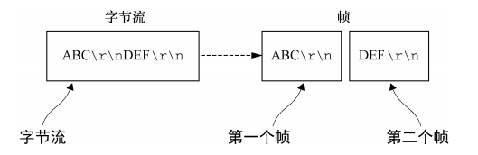

# TCP 粘包问题

TCP/IP所在的传输层有两个重要的协议：TCP 和 UDP。
TCP（传输控制协议）是一种面向连接的，提供高可靠性的协议。UDP（用户数据包协议）是无连接的，可以提供高效的传输服务的协议。
TCP是基于字节流的协议，这意味着它是无法知道消息边界的。我们在进行消息读取的时候，能收到的消息字节数是不确定的。

## 如何解决粘包问题

解决粘包问题，实际上就是解决如何去区分消息边界的问题，常见的有以下3种协议方案。

### 基于分隔符的协议

可以在消息开头或尾部使用定义的字符来标记的消息或者消息段。如通过`\n`或`\r\n`来标志消息边界。比如FTP就是使用这种方式。但有个缺陷，如果消息内容中就存在用来区分边界的标识，这种情况下是无法区分的。



代码实现读取逐行读取：

```c
static size_t recv_peek(int sockfd, void *buff, size_t len)
{
    while (1)
    {
        int ret = recv(sockfd, buff, len, MSG_PEEK);
        if (ret == -1 && errno == EINTR)
            continue;
        return ret;
    }
}

size_t readline(int sockfd, void *buff, size_t maxlen)
{
    int ret;
    int nread;
    char *pbuff = (char *)buff;
    int nleft = maxlen;
    while (1)
    {
        if ((ret = recv_peek(sockfd, pbuff, nleft)) < 0)
            return ret;
        else if (ret == 0)
            return ret;

        nread = ret;
        int i;
        for (i = 0; i < nread; i++)
        {
            if (pbuff[i] == '\n') //找到\n标记，直接返回
            {
                ret = readn(sockfd, pbuff, i + 1);
                if (ret != i + 1)
                    exit(EXIT_FAILURE);

                return ret;
            }
        }

        if (nread > nleft)
            exit(EXIT_FAILURE);

        //没有找到\n标记，全部读出
        nleft -= nread;
        ret = readn(sockfd, pbuff, nread);
        if (ret != nread)
            exit(EXIT_FAILURE);

        pbuff += nread;
    }

    return -1;
}
```

通过 Readline 函数，我们可以编写一个简单的回射服务器和客户端，其核心代码如下：

```c
void echo_handle(int connfd)
{
    int n;
    char line[1024] = {0};
    while (1)
    {
        // Read a line
        int ret = Readline(connfd, line, sizeof(line));
        if (ret == 0)
        {
            printf("client disconnect\n");
            break;
        }

        printf("echo %ld bytes, data receved at %s", strlen(line), line);

        // Write a line
        Writen(connfd, &line, strlen(line));

        memset(&line, 0, sizeof(line));
    }
    close(connfd);
}
```

你可以从 `Github` 获取项目源码，编译后，运行程序 `read_line_server` 和 `read_line_client` 查看实际效果。

### 基于长度的协议

这种情况下通常有两种方案，一种是固定长度，另外一种是通过包头部指定动态的长度。

#### 定长协议

发送端与接受端约定好一个指定的数据包长度，在数据发送接收时都按约定的长度进行消息操作。这种类型的协议通常比较简单，但灵活性不够。消息过长，无法正确发送；消息过短，又造成带宽浪费。


下面代码展示了固定读取和发送1024个字节的方法：

```c
char sendbuf[1024] = {0};
char recvbuf[1024] = {0};
while (fgets(sendbuf, sizeof(sendbuf), stdin) != NULL)
{
    write(sockfd, sendbuf, strlen(sendbuf));
    read(sockfd, recvbuf, sizeof(recvbuf));

    memset(&sendbuf, 0, sizeof(sendbuf));
    memset(&recvbuf, 0, sizeof(recvbuf));
}
```

#### 数据包头部长度编码协议

可以将长度编码放在消息的头部，来指定消息长度。比如头部消息用2个字节来存放消息长度，尾部则存放包含了该长度的数据。


对于这种包类型，我们可以通过一个结构体来简单描述：

```c
#define MAX_MSG_SIZE 1024

typedef struct
{
    short lenth;
    char buff[MAX_MSG_SIZE];
} package;
```

其中 length 代表数据包的包头，它是 buff 发送的实际长度，一般情况下，2个字节足够能表示我们需要的数据包长度。而 buff 里面存放的是我们要发送的数据包包体内容。

下面是一个读取和发送 package 的实例：

```c
void echo_handle(int connfd)
{
    int n;
    package recvbuf;
    while (1)
    {
        memset(&recvbuf, 0, sizeof(recvbuf));

        // Read a package
        int ret = Readn(connfd, &recvbuf.lenth, 2);
        if (ret < 2)
        {
            printf("client disconnect\n");
            break;
        }

        n = ntohs(recvbuf.lenth);
        ret = Readn(connfd, &recvbuf.buff, n);
        if (ret < n)
        {
            printf("client disconnect\n");
            break;
        }

        printf("echo %d bytes, data receved at %s", n, recvbuf.buff);

        // Write a package
        Writen(connfd, &recvbuf, n + 2);
    }
    close(connfd);
}
```

首先，我们通过 Readn 函数读取2个字节的包头长度标示，如果长度不足，代表客户端已经关闭。
有了长度标示后，再通过 length 标示的长度调用 Readn 函数再次读取包体的实际内容。
最后，打印输出收到的数据包大小和内容，并通过 Writen 回射消息给客户端。

你可以从 `Github` 获取项目源码，编译后，运行程序 `read_package_server` 和 `read_package_client` 查看实际效果。