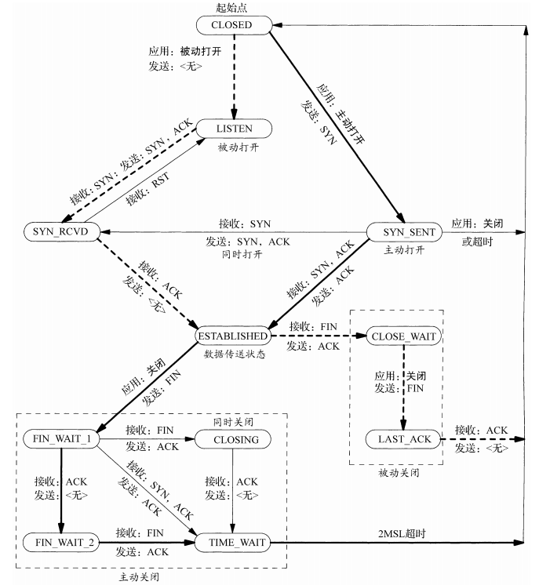
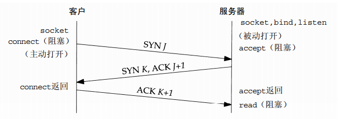
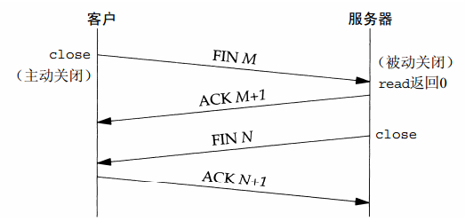

# TCP状态机

TCP 是一个面向连接的协议，所谓“连接”，其实就是通讯双方维护着一个“连接状态”，让两端看上去连接在一起一样。
TCP 为一个连接定义了11种状态，TCP 的状态是围绕着 “建立连接”，“交换数据”，“断开连接”3件事情来展开的。

TCP涉及连接建立和连接终止的操作可以用状态转换图来说明：

## TCP 连接的建立，三路握手

建立一个TCP连接时，称为三路握手，也称之为“请求 -> 应答 -> 应答之应答”的三个回合。

其用打电话接通流程来描述大概如下：

- A：你好，我是A
- B：你好A，我是B
- A：你好B，很高兴和你对话

具体到TCP会发生下述情形：

- 服务器必须准备好接受外来的连接。这通常通过调用socket、bind和listen这3个函数来完成，我们称之为被动打开（passive open） 。
- 客户通过调用connect发起主动打开（active open） 。这导致客户TCP发送一个SYN（同步）分节，它告诉服务器客户将在（待建立的）连接中发送的数据的初始序列号。通常SYN分节不携带数据，其所在IP数据报只含有一个IP首部、一个TCP首部及可能有的TCP选项。
- 服务器必须确认（ACK）客户的SYN，同时自己也得发送一个SYN分节，它含有服务器将在同一连接中发送的数据的初始序列号。服务器在单个分节中发送SYN和对客户SYN的ACK（确认） 。
- 客户必须确认服务器的SYN。

TCP的三路握手连接示意图如下：

双方的状态转换图看起来是这样的：

一开始，双方都是 CLOSE 状态。然后，服务器开始监听外来连接进入 LISTEN 状态。
客户端向服务器发起连接，发送了一个SYN分节，然后进入了SYN-SEND状态。
服务器接受客户端连接，并返回一个SYN和一个ACK客户端的SYN，进入SYN-RCVD状态。
客户端收到SYN和ACK后，再想服务器发送ACK的ACK，最终双方都进入了ESTABLISHED状态。
此时双方连接正式建立。

## TCP 连接终止，四路挥手

TCP建立一个连接需3个分节，而终止一个连接则需4个分节。

其用挂电话流程来描述大概如下：

- A：B，我先挂电话了。
- B：哦，那先说到这里吧。
- B：拜拜！
- A：好的嘞，下次再聊，拜拜！

具体到TCP会发生下述情形：

- 某个应用进程首先调用close，我们称该端执行主动关闭（active close）。该端的TCP于是发送一个FIN分节，表示数据发送完毕。
- 接收到这个FIN的对端执行被动关闭（passive close） 。这个FIN由TCP确认。它的接收也作为一个文件结束符（end-of-file）传递给接收端应用进程（放在已排队等候该应用进程接收的任何其他数据之后） ，因为FIN的接收意味着接收端应用进程在相应连接上再无额外数据可接收。
- 一段时间后，接收到这个文件结束符的应用进程将调用close关闭它的套接字。这导致它的TCP也发送一个FIN。
- 接收这个最终FIN的原发送端TCP（即执行主动关闭的那一端）确认这个FIN。

TCP的关闭连接示意图如下：

双方的状态转换图看起来是这样的：

发起断开连接的端，主动关闭，发送FIN分节后，进入FIN-WAIT-1状态。
对方收到后马上进入CLOSE-WAIT状态，并回复了一个ACK。
主动关闭端收到ACK后，进入FIN-WAIT-2状态，然后等待对方的下一个FIN。
被动关闭端发送字节的FIN，进入LAST_ACK。
客户端收到后，进入TIME-WAIT状态，并回复一个ACK。
对方如果顺利收到最后一个ACK，那么双方都会最终进入CLOSED状态。

## TIME-WAIT

TCP是假定网络是不可靠的情况下进行的，所以任何一个阶段都是可能对方失去响应。
我们知道，因为TCP是全双工的，所以断开连接时，需要4次挥手，也就是说发送方和接收方都需要FIN和ACK。

### MSL

主动关闭的端会发送一个FIN，既然网络会不稳定，所以可能对方已经掉线了，FIN就可能会超时。
TCP对传输在网络上的任何报文都会设置一个“最大报文生存时间”（Maximum Segment Lifetime）,简称MSL。
任何一个报文如果超时后，对方没有收到，都会被丢弃。而发送端则需要重传SYN。

### MSL与TIME-WAIT

主动关闭端，收到被动关闭方的FIN后，回应ACK后，会进入TIME-WAIT状态。但因为网络不稳定原因，如延迟什么的，并不能确保对方会收到这个ACK，所以会触发对方重传FIN。极端情况下，这种一来一回的时间就是两倍MSL时长。
而TIME-WAIT就是为了确保对方有足够的时间收到最后一个ACK而需要等待的时长。这也同时确保了旧连接在这个时间内不会被下一个新连接所混在一起。

### TIME-WAIT 数量过多怎么办

既然会有 TIME-WAIT 状态，而这个状态通常设置时间会在1到2分钟不等（Linux设置成了1分钟），如果每秒的连接数过多，可能会产生成千上万个TIME-WAIT，那么系统资源可能被消耗殆尽。对于这个问题，大概有以下几种解决方案：

- **tcp_tw_reuse**，重用TIME_WAIT连接，必须同时开启**tcp_timestamps**，收到最后一个包超过1s后可重用。
- **tcp_tw_recycle**，回收TIME_WAIT连接，必须同时开启**tcp_timestamps**，比较时间戳，如果时间戳变大了，就可以重用。。
- **tcp_max_tw_buckets**，控制TIME_WAIT总数，将多余的TIME_WAIT删除掉。